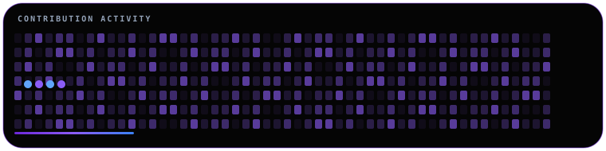

<div align="center">

<picture>
  <source media="(prefers-color-scheme: dark)" srcset="./banner.svg">
  <source media="(prefers-color-scheme: light)" srcset="./banner-light.svg">
  
</picture>

<br>



<br>

<a href="mailto:shivamyraj24@gmail.com">
  
</a>
<a href="https://github.com/yshivamcodes">
  
</a>
<br><br>


</div>

---

## ⚡ About Me

```text
SHIVAM YADAV
Aspiring Data Scientist • ML Builder • Developer

Turning Ideas Into Intelligent Systems.

I like taking a rough idea → data → model → usable system.
Currently sharpening Python, machine learning, data science and core programming.
```

## 🧠 Skills

<div align="center">

| Area | Skills |
|---|---|
| Data & AI | Machine Learning · Data Science · NLP · AI |
| Languages | Python · C · C++ · Java |
| Building | APIs · Full-stack prototypes · Streamlit · FastAPI |
| Workflow | Git · GitHub · Jupyter · VS Code |

</div>

## 📊 Local Developer Cards

<div align="center">
  
  
</div>

<br>

<div align="center">
  
</div>

## 🚀 Featured Projects

| Project | What it does | Stack |
|---|---|---|
| [Resume Analyzer](https://github.com/yshivamcodes/Resume-Analyzer) | AI-assisted resume analysis, skill matching and explainable scoring | Python · NLP · FastAPI · React |
| [Air Keyboard](https://github.com/yshivamcodes/Air-Keyboard-Gesture-Based-Virtual-Typing-System) | Gesture-based virtual typing using hand tracking | Python · OpenCV · MediaPipe · cvzone |
| [AI Assistant Chatbot](https://github.com/yshivamcodes/AI-Assistant-Chatbot) | Conversational AI assistant prototype | Python · AI |
| [Employee Salary Prediction](https://github.com/yshivamcodes) | ML salary prediction app | Python · scikit-learn · Streamlit |
| [Titanic Survival Prediction](https://github.com/yshivamcodes) | Classic supervised-learning classification project | Python · scikit-learn |
| [SkillBridge AI](https://github.com/yshivamcodes) | Career and skill guidance platform for first-generation learners | AI · Flask/FastAPI · React |

## 🧪 What I'm Building

- Machine-learning projects that solve concrete problems rather than only demo notebooks.
- Data-science workflows that move from raw data to useful decisions.
- AI-powered developer tools and practical automation.
- Stronger fundamentals in C/C++, Java, algorithms and computer science.

## 🐍 Contribution Animation

<div align="center">
  
</div>

> `snake.svg` is intentionally local and lightweight. If you later generate a real GitHub contribution snake with GitHub Actions, you can replace this file without changing the README.

## 📈 GitHub Activity

<div align="center">
  
</div>

> The activity graph is local and intentionally API-free. It is a visual design element, not a live GitHub contribution-data feed.

## 🤝 Connect

<div align="center">

**SHIVAM YADAV** · `@yshivamcodes`

[Email](mailto:shivamyraj24@gmail.com) · [GitHub](https://github.com/yshivamcodes)

<br>

### `KEEP CODING • KEEP GROWING`

</div>

---

<div align="center">

<sub>Built with SVG · CSS animations · local assets · a little curiosity.</sub>

</div>
